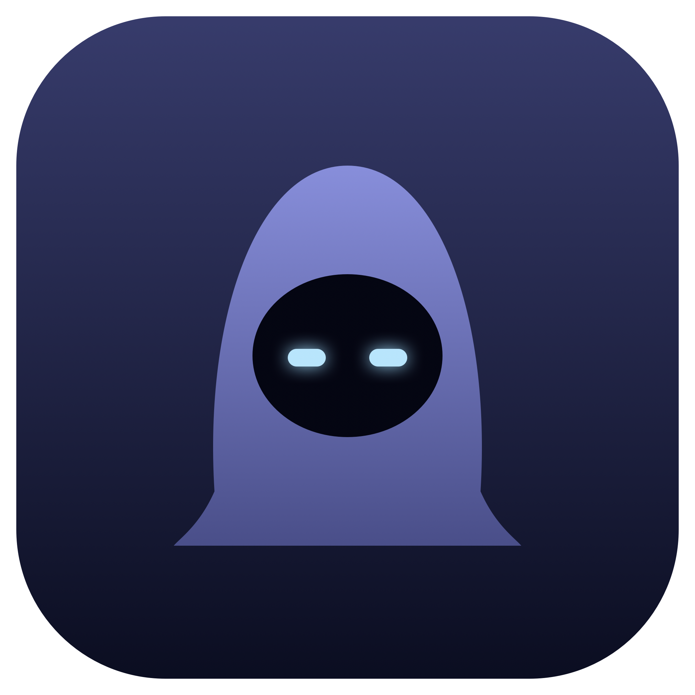

<p align="center">
  
</p>

<h1 align="center">Cloak</h1>

<p align="center">
  <strong>Your private AI workspace for conversations that move fast.</strong><br>
  A native macOS copilot for live context, clear next steps, and polished meeting follow-through.
</p>

<p align="center">
  <a href="#get-started">Get started</a> · <a href="#what-it-does">What it does</a> · <a href="#keyboard-first">Shortcuts</a> · <a href="#responsible-use">Responsible use</a>
</p>

---

## The calm layer in a busy conversation

Cloak is a lightweight macOS overlay that helps you stay present in calls, working sessions, and customer conversations. It keeps the important context close: a live, speaker-labelled transcript, quick AI assistance, and the meeting artifacts you need once the call is over.

Bring your own Anthropic or OpenAI-compatible API key, choose the model that fits the moment, and turn a fast-moving conversation into a useful record—without adding another bot to the call.

> Built for prepared, transparent collaboration. Cloak is not for bypassing consent, workplace rules, assessments, or interview policies.

## What it does

| In the moment | After the conversation |
| --- | --- |
| **Live context** — captures a rolling, speaker-labelled conversation record from system audio and optional push-to-talk input. | **Structured recap** — turns the discussion into a summary, decisions, open questions, and next steps. |
| **Ask naturally** — get concise, context-aware answers or a useful suggestion for what to say next. | **Action-ready output** — extracts owner-aware to-dos and likely follow-up questions. |
| **Auto Q&A** — optionally responds when a spoken question is detected. | **Keep the thread** — save sessions locally, revisit them from the meeting library, and export clean Markdown. |
| **Bring your own model** — use Anthropic or any OpenAI-compatible endpoint, including a custom base URL. | **Bring context in** — attach PDF or text notes to focus assistance on this session. |

### Designed to stay out of your way

- Native, movable, translucent macOS panel with light, dark, and adaptive themes
- Keyboard-first controls, including hold-to-talk
- Streaming answers with Markdown, code blocks, and checklists
- An accessory-style app experience with no call participant or meeting bot
- A capture-excluded panel configuration for privacy-conscious desktop workflows; enable Debug mode when you need the overlay visible in screenshots for diagnostics

## Get started

### Requirements

- macOS 14.2 or later
- Xcode Command Line Tools / Swift 6.2
- An Anthropic API key or an API key for an OpenAI-compatible provider

### Run from source

```bash
git clone https://github.com/karki011/Cloak.git
cd Cloak
swift run Cloak
```

On first launch, macOS will guide you through the permissions Cloak needs:

- **Microphone** and **Speech Recognition** for push-to-talk input
- **Accessibility** for global shortcuts
- **Screen Recording** is optional and only supports the adaptive overlay theme

Open settings with `⌃⌥,`, add your provider key, choose a model, and start a session.

### Build an app bundle

```bash
swift build -c release
./bundle.sh
open Cloak.app
```

`bundle.sh` signs the app with an available local signing identity, falling back to ad-hoc signing if needed. With ad-hoc signing, macOS may ask for permissions again after each rebuild.

## Keyboard-first

| Shortcut | Action |
| --- | --- |
| `⌃⌥Space` | Show or hide the overlay |
| `⌃⌥Return` | Send a question |
| Hold `Right ⌥` | Push to talk |
| `⌃⌥M` | Toggle push-to-talk listening |
| `⌃⌥L` | Toggle continuous system-audio listening |
| `⌃⌥E` | Generate and save a meeting summary |
| `⌃⌥,` | Open settings |
| `⌃⌥Q` | Quit Cloak |
| `Esc` | Hide the overlay |

## Privacy, on your terms

Cloak is designed around local control:

- API keys are stored in the macOS Keychain.
- Meeting history is stored locally in your Application Support directory.
- Markdown exports are saved locally and can be deleted whenever you choose.
- Model requests go directly to the provider and endpoint you configure—there is no Cloak account or hosted Cloak backend in this repository.

Speech recognition, operating-system permissions, and model-provider data handling are governed by Apple and the provider you choose. Review those settings and policies before using the app with sensitive information.

## Responsible use

Use Cloak only when all applicable participants, organizations, and policies allow it. Get consent where required, especially before capturing or transcribing a conversation. Do not use it to misrepresent your own work, evade recording or disclosure requirements, or gain an unfair advantage in interviews, examinations, or other evaluations.

## Project map

```text
Sources/Cloak/
├── OverlayView.swift         # SwiftUI overlay and meeting library UI
├── OverlayViewModel.swift    # conversation state, assist actions, exports
├── ScreenAudioManager.swift  # system-audio capture and transcription flow
├── SpeechManager.swift       # push-to-talk speech input
├── LLMProvider.swift         # Anthropic and OpenAI-compatible streaming clients
├── Settings.swift            # provider, model, appearance, and shortcut settings
└── MeetingStore.swift        # local meeting history and context extraction
```

## Development

```bash
swift build
```

For a diagnostic-friendly overlay, turn on **Debug mode** in Settings and relaunch. Debug mode makes the overlay visible to screenshots so UI issues can be captured and investigated.

## Contributing

Issues and pull requests are welcome. Please keep changes macOS-native, avoid introducing unnecessary telemetry or remote infrastructure, and include a short verification note with UI or audio-related changes.
